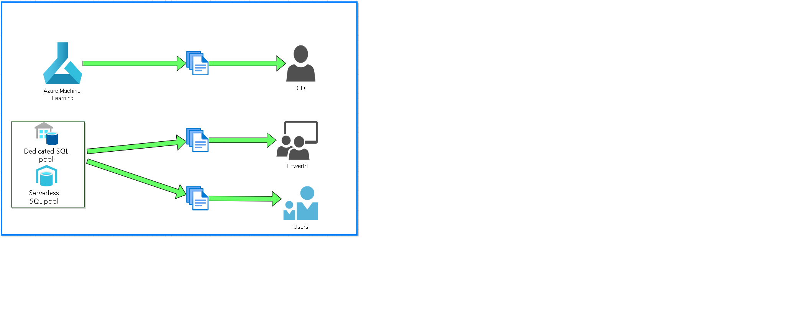

## __Objetivo__

O objetivo deste documento é descrever os serviços a serem utilizados na proposta de arquitetura inicial

Os serviços a serem descritos serão:
Azure Synapse Analytics

## __Proposta inicial__

## __Serviços a serem Utilizados__
Azure Synapse Analytics

É um serviço de análise de dados em larga escala na nuvem oferecido pela Microsoft Azure. Ele permite que as empresas processem e analisem grandes volumes de dados em tempo real, unificando a ingestão, preparação, gerenciamento e consulta de dados em um único ambiente.

## __Fluxo de Dados__

Fluxo 1 

A primeira parte do fluxo é a ingestão dos dados no data lake de forma bruta e sem transformação prévia. Tanto os dados da base TOTVS quanto as bases geradas através de arquivos (carga fria).

Fluxo 2

A segunda parte do fluxo é a ingestão e tratamento dos dados no data lake levando em consideração a arquitetura delta lake house que faz o gerenciamento dos dados por camadas e define o ciclo de ingestão dos dados de forma mais organizada.

Fluxo 3

Uma vez que os dados estão tratados e disponibilizados na camada gold do delta lake, podemos disponibilizá-los para consulta e utilização.

Fluxo 4

Por fim, teremos os dados tratados e disponíveis para suas devidas finalidades. Tanto a ciência de Dados pode atuar quando as áreas de negócio podem fazer o seu fluxo corriqueiro de trabalho direto do Data Lake.
